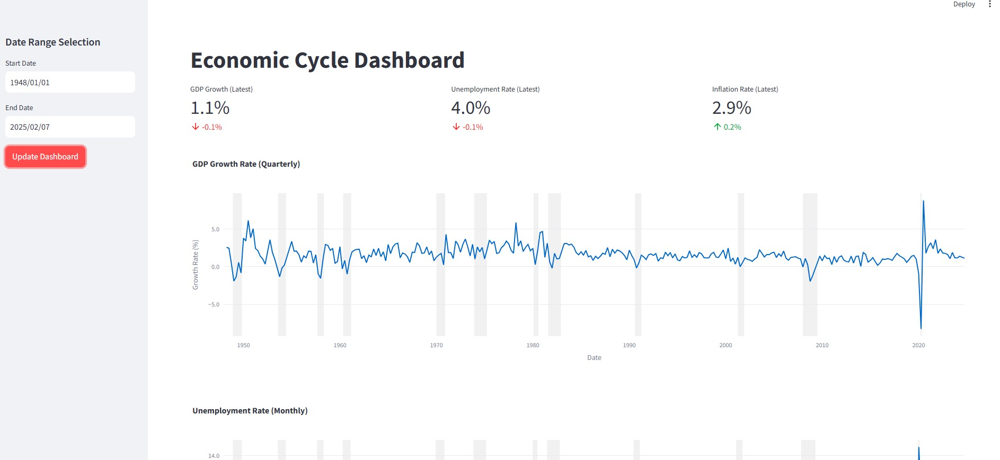
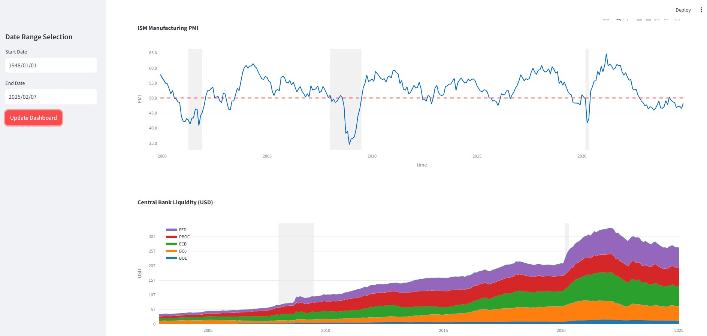

# Macro Dashboard

## Overview
The goal of this project is to assess the macro landscape for US financial markets and to identify the current stages of key economic cycles. By developing and presenting our bias on this dashboard, we aim to provide actionable market guidance for users.

## Project Phases

### Phase 1: Data Visualization & Analysis (Current)
The initial phase focuses on delivering informative visualizations of key macro indicators:
- GDP Growth 
- Unemployment Rate
- Inflation Rate 
- Global Central Bank Balance Sheets & Liquidity Conditions
- Manufacturing PMI 
- US Federal Debt

### Phase 2: Quantitative Risk Framework (Upcoming)
Development of a proprietary recession probability model:
- Forward-looking risk metrics with varying time horizons (quarterly/monthly/weekly)
- Composite scoring system incorporating multiple economic factors
- Normalized risk scale (0-100%) for cycle positioning
- Real-time probability updates as new data becomes available

## Data Sources
- Federal Reserve Economic Data (FRED): GDP Growth, Unemployment Rate, Inflation Rate, US Federal Debt
- Yahoo Finance: S&P 500
- TradingView: 
    ISM - USMPR
    Liquidity: central bank balance sheet from US, CN, JP, UK, EU - USCBBS, CNCBBS, JPCBBS, EUCBBS, GBCBBS

## Key Challenges/Considerations
- Selecting the right indicators to capture the current macro landscape
- Data Sourcing: Obtaining reliable and timely data for key indicators, particularly ISM, presented significant challenges.
- Selecting the appropriate charting tool. Considered tradinview charting tool, but need to use typescript/javascript.
- Explored the feature to overlay sp500 chart on all the charts - opted to not include it to optimise for loading speed and simple design.

## Demonstration

---

Notes:

Recession definition
https://www.nber.org/research/business-cycle-dating/business-cycle-dating-procedure-frequently-asked-questions

